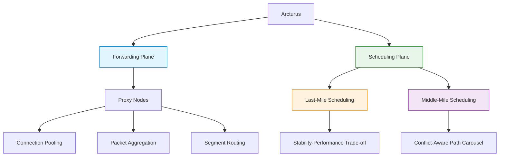

# Arcturus 🌌  
*A Cloud-Native Global Accelerator Framework*


## 📌 Overview  
Arcturus revolutionizes **Global Acceleration (GA)** by dynamically orchestrating low-cost, multi-cloud resources to deliver **high-performance, low-latency networking** without vendor lock-in. Unlike traditional cloud-bound GA services, Arcturus achieves **1.7× faster acceleration at 71% lower cost** while maintaining >80% resource efficiency.  

**Ideal for**:  
- Real-time interactive applications  
- Cost-sensitive large-scale deployments  
- Multi-cloud or hybrid-cloud environments  

## ✨ Key Features  
| **Feature**               | **Advantage**                                                                 |
|---------------------------|-------------------------------------------------------------------------------|
| **Multi-Cloud Adaptive**  | Leverages heterogeneous resources across providers (AWS, GCP, etc.)    |
| **Two-Plane Architecture**| Forwarding plane (adaptive proxies) + Scheduling plane (lightweight optimization) |
| **Cost Efficiency**       | Reduces expenses by 71% vs. commercial GA services                            |
| **Scalability**          | Proven at million-RPS workloads with stable QoS                              |

## 🏗️ Architecture  



## 🚀 Quick Start Guide

### 📋 Prerequisites
| Requirement       | Version  | Verification Command       |
|-------------------|----------|----------------------------|
| Kubernetes        | ≥1.23    | `kubectl version --short`  |
| Terraform         | ≥1.4     | `terraform --version`       |
| Helm              | ≥3.11    | `helm version --short`      |

## 🛠️ Installation
### Method : Helm 
```bash
# Add Arcturus repo
helm repo add arcturus https://charts.arcturus.io/stable

# Install with production profile
helm install arcturus arcturus/arcturus \
  --namespace arcturus-system \
  --create-namespace \
  --values https://raw.githubusercontent.com/your-repo/arcturus/main/config/production.yaml
```

## 🏆 Comparative Metrics
### Public Internet vs Arcturus Latency Comparison (Washington / Osaka / London Server Deployment)

| Route                      | Direct (ms) | Arcturus (ms) | Improvement |
|----------------------------|-------------|---------------|-------------|
| Mexico → Osaka             | 150         | 74            | 50.67%     |
| Santiago → Washington      | 143         | 77            | 46.15%     |
| Bangalore → Osaka         | 112         | 78            | 30.36%     |
| Querétaro → London        | 123         | 74            | 39.84%     |
| Singapore → London        | 171         | 99            | 42.11%     |
| Tel Aviv → Washington     | 133         | 75            | 43.61%     |
| Frankfurt → Osaka         | 190         | 104           | 45.26%     |
| **Average Latency**          | **146.0**   | **83.3**      | **42.54%** |
### GCP Global Load Balancing vs Arcturus Latency Comparison (New York Server Deployment)

| Route                  | GCP Latency (ms) | Arcturus Latency (ms) | Improvement |
|------------------------|------------------|-----------------------|-------------|
| Bangalore → New York   | 267              | 142                   | 46.8%     |
| Johannesburg → NY     | 176              | 128                   | 27.3%     |
| Osaka → NY            | 213              | 111                   | 47.9%     |
| Querétaro → NY        | 70               | 54                    | 22.9%     |
| London → NY           | 74               | 61                    | 17.6%     |
| Santiago → NY         | 170              | 97                    | 42.9%     |
| Tel Aviv → NY         | 150              | 85                    | 43.3%     |
| Frankfurt → NY        | 58               | 69                    | -19.0%    |
| **Average Latency**    | **147.5**        | **93.4**             | **36.7%** |

### AWS GA vs Arcturus Latency Comparison Latency Comparison (Los Angeles Server Deployment)

| Route               | AWS GA (ms) | Arcturus (ms) | Improvement |
|---------------------|-------------|---------------|-------------|
| London → LA         | 135         | 91            | 32.6%      |
| Frankfurt → LA      | 141         | 87            | 38.3%      |
| Madrid → LA         | 152         | 99            | 34.9%      |
| Tel Aviv → LA       | 176         | 136           | 22.7%      |
| Johannesburg → LA   | 220         | 149           | 32.3%      |
| Virginia → LA       | 73          | 43            | 41.1%      |
| Singapore → LA      | 177         | 138           | 22.0%      |
| **Average Latency** | **153.3**   | **106.3**     | **30.7%** |


## License Agreement

## 📑 Apache 2.0 Summary
Permits:
- ✅ Commercial use  
- ✅ Modification  
- ✅ Patent use  
- ✅ Private use  

Requirements:
- ℹ️ License and copyright notice preservation  
- ℹ️ State changes  

