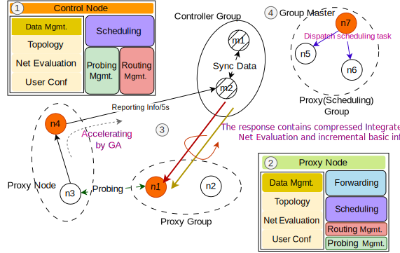

# Arcturus 🌌  
*A Cloud-Native Global Accelerator Framework*


## 📌 Overview  
**Arcturus** redefines **Global Acceleration (GA)** by dynamically orchestrating low-cost, multi-cloud resources to deliver **high-performance, low-latency, and highly stable networking** — all without the constraints of vendor lock-in. Unlike traditional cloud-tied GA solutions, Arcturus achieves **1.7× faster acceleration at 71% lower cost** on the forwarding plane, while sustaining over **80% resource efficiency**, significantly boosting both performance and stability at the data plane level. On the scheduling plane, Arcturus *analyzes the heterogeneity of hybrid-cloud infrastructure and the dynamic behavior of acceleration workloads*, and based on these insights, *designs specialized scheduling strategies*. It combines **last-mile scheduling based on Lyapunov optimization** with **mid-mile scheduling formulated as a constrained maximum flow problem**, jointly optimizing acceleration performance and system stability to achieve **Pareto-optimal efficiency** across diverse network conditions.


## ✨ Key Features  
| **Feature**               | **Advantage**                                                                 |
|---------------------------|-------------------------------------------------------------------------------|
| **Multi-Cloud Adaptive**  | Leverages heterogeneous resources (AWS, Vultr, etc.) to cut system costs by over 70% |
| **High Performance**  | 1.7× faster acceleration​​ via streaming multiplexing, packet merging, and CMAB tuning |
| **​​Hybrid Scheduling​**| Lyapunov-based load balancing (last-mile) + Carousel Greedy for path diversity (mid-mile) |

## 🏆 Comparative Metrics
### Public Internet vs Arcturus Latency Comparison

| Route                      | Direct (ms) | Arcturus (ms) | Improvement |
|----------------------------|-------------|---------------|-------------|
| Mexico → Osaka             | 150         | 74            | 50.67%     |
| Santiago → Washington      | 143         | 77            | 46.15%     |
| Bangalore → Osaka         | 112         | 78            | 30.36%     |
| Querétaro → London        | 123         | 74            | 39.84%     |
| Singapore → London        | 171         | 99            | 42.11%     |
| Tel Aviv → Washington     | 133         | 75            | 43.61%     |
| Frankfurt → Osaka         | 190         | 104           | 45.26%     |
| **Average Latency**          | **146.0**   | **83.3**      | **42.54%** |

## Global Latency Comparison: GCP vs. AWS vs. Arcturus

| Route                  | Provider   | Baseline (ms) | Arcturus (ms) | Improvement (%) |
|------------------------|------------|----------------------|----------------------|-----------------|
| Bangalore → New York   | GCP        | 267.0                | 142.0                | 46.8%          |
| Johannesburg → NY      | GCP        | 176.0                | 128.0                | 27.3%          |
| London → NY            | GCP        | 74.0                 | 61.0                 | 17.6%          |
| London → Los Angeles   | AWS GA     | 135.0                | 91.0                 | 32.6%          |
| Virginia → LA          | AWS GA     | 73.0                 | 43.0                 | 41.1%          |
| Singapore → LA         | AWS GA     | 177.0                | 138.0                | 22.0%          |
| **Average**           | —          | **150.3**            | **100.5**            | **31.2%**   |

## 🏗️ Architecture 
1. **Controller Nodes**: Master nodes that:
   - Aggregate global performance metrics
   - Analyze data and formulate high-level routing decisions
   - Manage configuration distribution to all nodes
   - Coordinate system-wide operations to ensure consistency

2. **Proxy Nodes**: Edge nodes that:
   - Receive and implement controller-distributed forwarding policies
   - ​​Execute localized routing decisions
   - ​​Process traffic flows with policy enforcement
   - Report real-time performance telemetry to controllers



## 🚀 Quick Start Guide
```bash
wget https://github.com/Lvpcgithub/Arcturus/archive/refs/heads/main.zip && \
unzip main.zip && \
mv Arcturus-main Arcturus && \
rm main.zip

cd /Arcturus

# Add execute permissions to all scripts that need to be run (one-time operation)
chmod +x setup_public_env.sh
chmod +x /forwarding/deploy_forwarding.sh
chmod +x /scheduling/deploy_scheduling.sh

# Run common environment setup (e.g., Go, etcd)
./setup_public_env.sh

# If you want deploy forwarding, run forwarding-specific environment setup
./forwarding/deploy_forwarding.sh

# If you want deploy scheduling, run scheduling-specific environment setup
./scheduling/deploy_scheduling.sh

```

• [Scheduling ](./scheduling/README.md) - Details for the scheduling plane            
• [Forwarding ](./forwarding/README.md) - Details for the forwarding plane

## License Agreement

## 📑 Apache 2.0 Summary
Permits:
- ✅ Commercial use  
- ✅ Modification  
- ✅ Patent use  
- ✅ Private use  

Requirements:
- ℹ️ License and copyright notice preservation  
- ℹ️ State changes  

