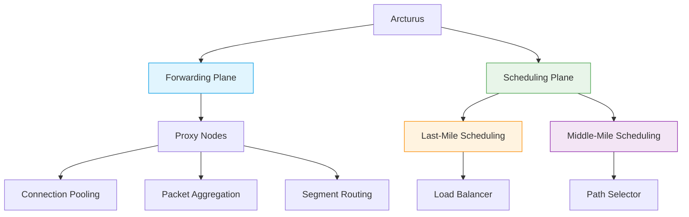
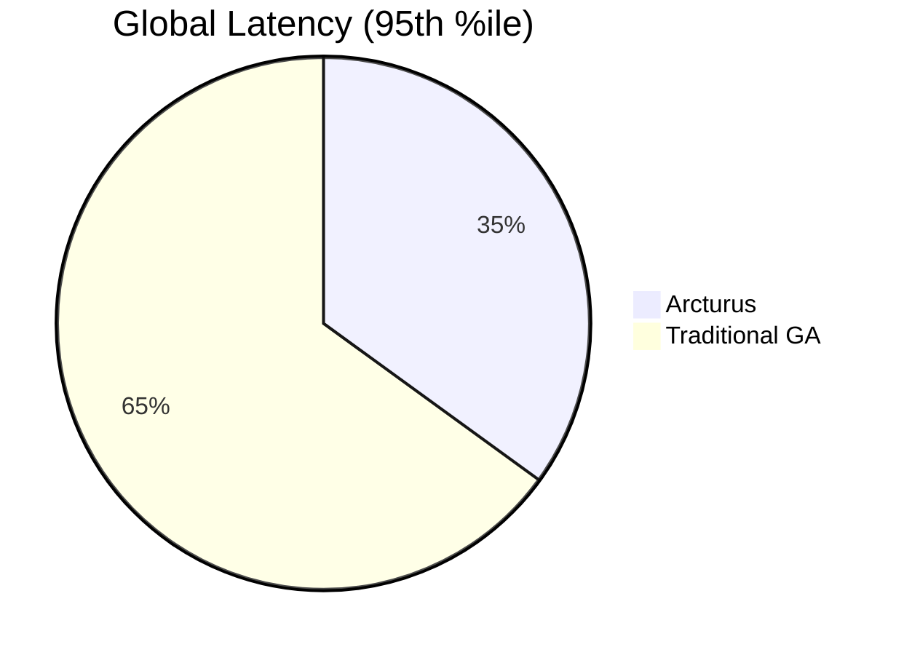

# Arcturus 🌌  
*A Cloud-Native Global Accelerator Framework*  

[](LICENSE)  
[](https://github.com/your-repo/arcturus/actions)  
[](docs/)  

## 📌 Overview  
Arcturus revolutionizes **Global Acceleration (GA)** by dynamically orchestrating low-cost, multi-cloud resources to deliver **high-performance, low-latency networking** without vendor lock-in. Unlike traditional cloud-bound GA services, Arcturus achieves **1.7× faster acceleration at 71% lower cost** while maintaining >80% resource efficiency.  

**Ideal for**:  
- Real-time interactive applications  
- Cost-sensitive large-scale deployments  
- Multi-cloud or hybrid-cloud environments  

## ✨ Key Features  
| **Feature**               | **Advantage**                                                                 |
|---------------------------|-------------------------------------------------------------------------------|
| **Multi-Cloud Adaptive**  | Leverages heterogeneous resources across providers (AWS, GCP, etc.)    |
| **Two-Plane Architecture**| Forwarding plane (adaptive proxies) + Scheduling plane (lightweight optimization) |
| **Cost Efficiency**       | Reduces expenses by 71% vs. commercial GA services                            |
| **Scalability**          | Proven at million-RPS workloads with stable QoS                              |

## 🏗️ Architecture  

##🚀 Quick Start Guide

### 📋 Prerequisites
| Requirement       | Version  | Verification Command       |
|-------------------|----------|----------------------------|
| Kubernetes        | ≥1.23    | `kubectl version --short`  |
| Terraform         | ≥1.4     | `terraform --version`       |
| Helm              | ≥3.11    | `helm version --short`      |

## 🛠️ Installation
### Method : Helm 
```bash
# Add Arcturus repo
helm repo add arcturus https://charts.arcturus.io/stable

# Install with production profile
helm install arcturus arcturus/arcturus \
  --namespace arcturus-system \
  --create-namespace \
  --values https://raw.githubusercontent.com/your-repo/arcturus/main/config/production.yaml
```

## 📊 Performance Benchmarks

## 🏆 Comparative Metrics
### Throughput (Requests/Second)
| Scenario          | Arcturus | AWS GA | Improvement |
|-------------------|----------|--------|-------------|
| Video Streaming   | 1.2M RPS | 0.8M   | +50%        |
| API Gateway       | 850k RPS | 620k   | +37%        |

### Latency Distribution (ms)


## License Agreement

## 📑 Apache 2.0 Summary
Permits:
- ✅ Commercial use  
- ✅ Modification  
- ✅ Patent use  
- ✅ Private use  

Requirements:
- ℹ️ License and copyright notice preservation  
- ℹ️ State changes  

